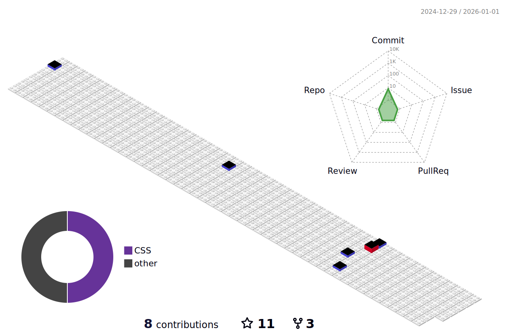
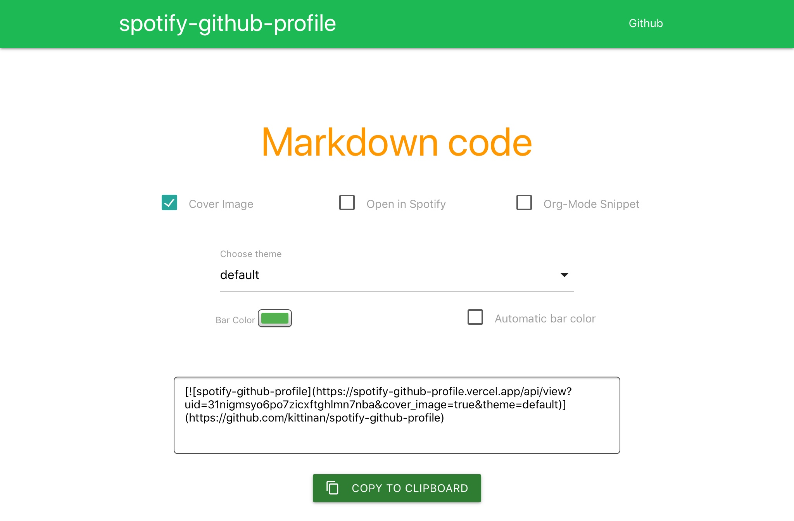
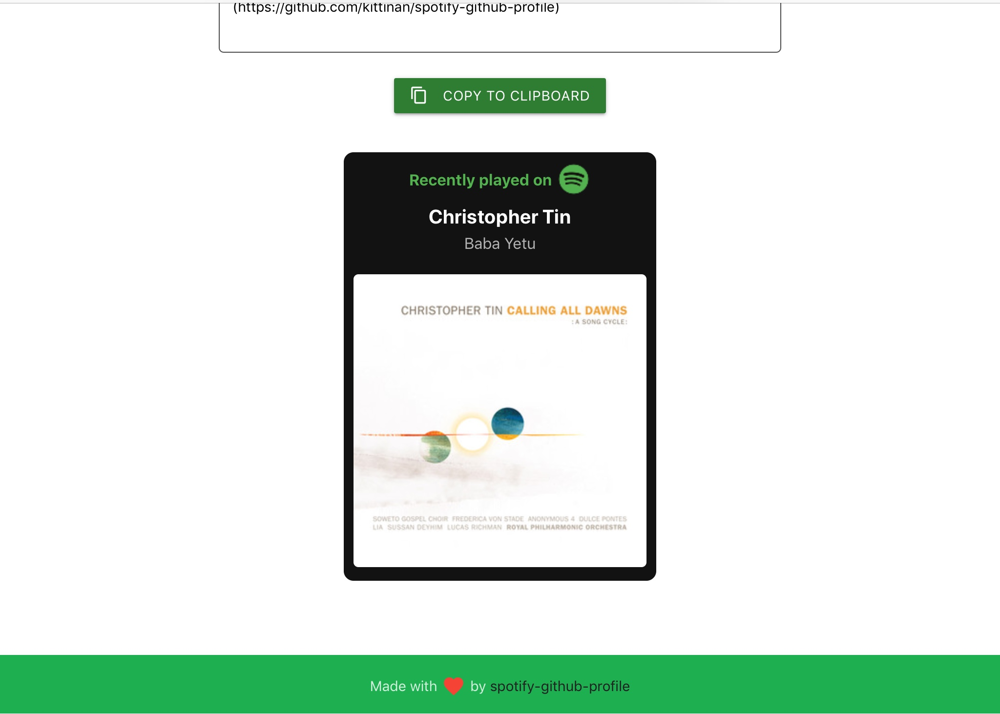

   

# Table of Contents <a id="Table_Of_Content"></a>

1. [Introduction](#introduction-)
2. [Snake Animation](#snake-animation-)
3. [3D Profile Contribution](#3d-profile-Contribution-)
4. Wakatime Stats
    1. [By athul](#wakatime-stats-by-athul-)
5. [Recent Activity](#recent-activity-)
6. [Spotify Playing Now](#spotify-playing-now-)
7. <a href="https://github.com/lowlighter/metrics">Profile Metrics (lowlighter)</a>

# Introduction <a id="Introduction"></a>
Here I tested cool things for readme profiles. If you like this, please do give a star :star2:! :hugs:

***:warning: Copyright Disclaimer: I DO NOT own these codes. All rights belonged to their respective owners! No copyright infringement intended.***
<hr>


# Snake Animation <a id="Snake_Animation"></a>


- Name your main branch as `master` or change the line 14 `master` to `main`
- Then Create another branch named `output`
- Create `/.github/snake.yml` in main branch
- Paste the following codes in that file

```yml
name: generate snake animation

on:
  # run automatically every 24 hours
  schedule:
    - cron: "0 */24 * * *" 
  
  # allows to manually run the job at any time
  workflow_dispatch:
  
  # run on every push on the master branch
  push:
    branches:
    - master # or main
    
  

jobs:
  generate:
    runs-on: ubuntu-latest
    timeout-minutes: 10
    
    steps:
      # generates a snake game from a github user (<github_user_name>) contributions graph, output a svg animation at <svg_out_path>
      - name: generate github-contribution-grid-snake.svg
        uses: Platane/snk/svg-only@v2
        with:
          github_user_name: ${{ github.repository_owner }}
          outputs: |
            dist/github-contribution-grid-snake.svg
            dist/github-contribution-grid-snake-dark.svg?palette=github-dark

      # push the content of <build_dir> to a branch
      # the content will be available at https://raw.githubusercontent.com/<github_user>/<repository>/<target_branch>/<file> , or as github page
      - name: push github-contribution-grid-snake.svg to the output branch
        uses: crazy-max/ghaction-github-pages@v2.6.0
        with:
          target_branch: output
          build_dir: dist
        env:
          GITHUB_TOKEN: ${{ secrets.GITHUB_TOKEN }}
```

- Run the Workflow in action.
- If it is successful, it will create 2 svg, 1 for dark mode another one for light mode.

***Original source : <a href="https://github.com/Platane/snk">Platane</a>***<br>
[Back To Top](#table-of-contents-)
<hr>


# 3D Profile Contribution <a id="3D_Profile_Contribution">


- Create `/.github/profile-3d.yml`
- Paste the following codes in that file

```yml
name: GitHub-Profile-3D-Contrib

on:
  schedule:
    - cron: "0 18 * * *"
  workflow_dispatch:

jobs:
  build:
    runs-on: ubuntu-latest
    name: generate-github-profile-3d-contrib
    steps:
      - uses: actions/checkout@v2
      - uses: yoshi389111/github-profile-3d-contrib@0.6.0
        env:
          GITHUB_TOKEN: ${{ secrets.GITHUB_TOKEN }}
          USERNAME: ${{ github.repository_owner }}
      - name: Commit & Push
        run: |
          git config user.name github-actions
          git config user.email github-actions@github.com
          git add -A .
          git commit -m "generated"
          git push
```

- Run the Workflow in action.
- If it is successful, it will create 10 svg in profile-3d-contributions file.
  
***Original source : <a href="https://github.com/yoshi389111/github-profile-3d-contrib/tree/main">:copyright: yoshi389111</a>***<br>
[Back To Top](#table-of-contents-)
<hr>
  
  
  
  
# Wakatime Stats By athul <a id="Wakatime_stats_athul"> 
<!--START_SECTION:waka-->

```txt
From: 11 July 2022 - To: 29 October 2023

Total Time: 356 hrs

HTML             152 hrs 59 mins ██████████▓░░░░░░░░░░░░░░   42.97 %
Markdown         70 hrs 55 mins  █████░░░░░░░░░░░░░░░░░░░░   19.92 %
CSS              40 hrs 14 mins  ██▓░░░░░░░░░░░░░░░░░░░░░░   11.30 %
JavaScript       37 hrs 39 mins  ██▓░░░░░░░░░░░░░░░░░░░░░░   10.58 %
Other            32 hrs 44 mins  ██▒░░░░░░░░░░░░░░░░░░░░░░   09.20 %
```

<!--END_SECTION:waka-->` in your README file.
- Go to your repo's Settings -> Secrets and add a new secret named `WAKATIME_API_KEY` with your API key as it's value.
- Create `.github/workflow/Wakatime.yml`
- Add Following codes in your YML file

```yml
name: Waka Readme
on:
  workflow_dispatch:

jobs:
  update-readme:
    name: WakaReadme DevMetrics
    runs-on: ubuntu-latest
    steps:
      - uses: athul/waka-readme@master
        with:
          WAKATIME_API_KEY: ${{ secrets.WAKATIME_API_KEY }}
          SHOW_TITLE: true
          BLOCKS: ->
          TIME_RANGE: all_time
          SHOW_TIME: true
          SHOW_MASKED_TIME: true
```

***Original source : <a href="https://github.com/athul/waka-readme">:copyright: athul</a>***<br>
[Back To Top](#table-of-contents-)
<hr>

 
# :zap: Recent Activity <a id="recent-activity-">

<!--START_SECTION:activity-->
1. 🎉 Merged PR [#13](https://github.com/NyanKaungSet/Markdown/pull/13) in [NyanKaungSet/Markdown](https://github.com/NyanKaungSet/Markdown)
2. 💪 Opened PR [#13](https://github.com/NyanKaungSet/Markdown/pull/13) in [NyanKaungSet/Markdown](https://github.com/NyanKaungSet/Markdown)
3. 🎉 Merged PR [#12](https://github.com/NyanKaungSet/Markdown/pull/12) in [NyanKaungSet/Markdown](https://github.com/NyanKaungSet/Markdown)
4. 💪 Opened PR [#12](https://github.com/NyanKaungSet/Markdown/pull/12) in [NyanKaungSet/Markdown](https://github.com/NyanKaungSet/Markdown)
5. 🎉 Merged PR [#8](https://github.com/NyanKaungSet/Lighthouse/pull/8) in [NyanKaungSet/Lighthouse](https://github.com/NyanKaungSet/Lighthouse)
<!--END_SECTION:activity-->

<hr>
  
- Add the comment `<!--START_SECTION:activity-->` and `<!--END_SECTION:activity-->` in your README.md.
- Copy all the codes. 
- Sometimes, it doesn't work, when you only copy the `<!--START_SECTION:activity-->` and `<!--END_SECTION:activity-->`
  
```md
# :zap: Recent Activity

<!--START_SECTION:activity-->
1. 🎉 Merged PR [#90](https://github.com/CartimDraluc/Cartimpedia/pull/90) in [CartimDraluc/Cartimpedia](https://github.com/CartimDraluc/Cartimpedia)
2. 💪 Opened PR [#90](https://github.com/CartimDraluc/Cartimpedia/pull/90) in [CartimDraluc/Cartimpedia](https://github.com/CartimDraluc/Cartimpedia)
3. 🗣 Commented on [#89](https://github.com/CartimDraluc/Cartimpedia/issues/89) in [CartimDraluc/Cartimpedia](https://github.com/CartimDraluc/Cartimpedia)
4. ❗️ Closed issue [#89](https://github.com/CartimDraluc/Cartimpedia/issues/89) in [CartimDraluc/Cartimpedia](https://github.com/CartimDraluc/Cartimpedia)
5. ❗️ Opened issue [#89](https://github.com/CartimDraluc/Cartimpedia/issues/89) in [CartimDraluc/Cartimpedia](https://github.com/CartimDraluc/Cartimpedia)
<!--END_SECTION:activity-->
```
- Create file name .github/workflows/update-readme.yml.
- Copy the following codes.
- Note that the job runs every half an hour.
- make sure you created GITHUB_TOKEN with following scopes in your Personal access tokens.
- admin:public_key, gist, notifications, workflow, write:packages

### YML file
```yml
name: Recent Activity

on:
  schedule:
     - cron: '0 0  * * 0'
  workflow_dispatch:

jobs:
  build:
    runs-on: ubuntu-latest
    name: Update this repo's README with recent activity
    permissions:
      contents: write

    steps:
      - uses: actions/checkout@v3
      - uses: jamesgeorge007/github-activity-readme@master
        env:
          GITHUB_TOKEN: ${{ secrets.GITHUB_TOKEN }}
```

***Original source : <a href="https://github.com/jamesgeorge007">jamesgeorge007</a>***<br>
[Back To Top](#table-of-contents-)
<hr>


# Spotify Playing Now <a id="Spotify_Playing_Now">
<div align=center><a href="https://github.com/kittinan/spotify-github-profile"></a></div>

- Go to <a href="https://spotify-github-profile.vercel.app/api/login">Spotify GitHub Profile</a>
- Sign in to Spotify
  
<hr>

<hr>

- Copy the MarkDown Code and paste it in your README file.

<hr>


<br>

***Original source : <a href="https://github.com/kittinan/spotify-github-profile">kittinan</a>***<br>
[Back To Top](#table-of-contents-)
<hr>

 ### :warning: *Actions Status*
 
[](https://github.com/NyanKaungSet/Github-Workflow/actions/workflows/fortune.yml) [](https://github.com/NyanKaungSet/Github-Workflow/actions/workflows/snake.yml) [](https://github.com/NyanKaungSet/Github-Workflow/actions/workflows/metric.yml) [](https://github.com/NyanKaungSet/Github-Workflow/actions/workflows/profile-3d.yml) [](https://github.com/NyanKaungSet/Github-Workflow/actions/workflows/recent-activity.yml) [](https://github.com/NyanKaungSet/Github-Workflow/actions/workflows/wakatime.yml)


<h1 align="center">
  <a href="https://git.io/typing-svg">
    
  </a>
</h1>
