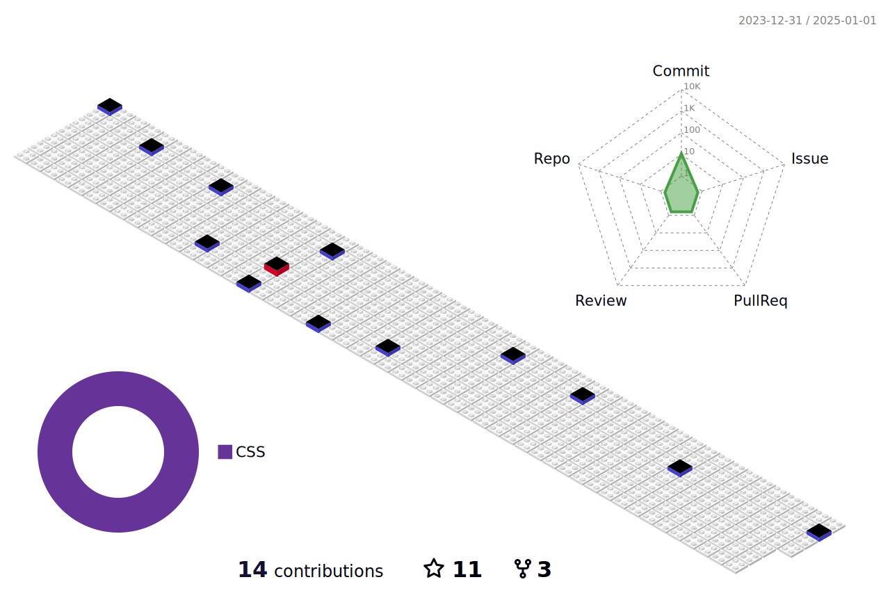

# Github-Workflow
Here I tested cool things for readme profiles.

## Snake Animation


## Profile 3D


- Create `/.github/profile-3d.yml`
- Paste the following codes in that file
```yml
name: GitHub-Profile-3D-Contrib

on:
  schedule:
    - cron: "0 18 * * *"
  workflow_dispatch:

jobs:
  build:
    runs-on: ubuntu-latest
    name: generate-github-profile-3d-contrib
    steps:
      - uses: actions/checkout@v2
      - uses: yoshi389111/github-profile-3d-contrib@0.6.0
        env:
          GITHUB_TOKEN: ${{ secrets.GITHUB_TOKEN }}
          USERNAME: ${{ github.repository_owner }}
      - name: Commit & Push
        run: |
          git config user.name github-actions
          git config user.email github-actions@github.com
          git add -A .
          git commit -m "generated"
          git push
```

- Run the Workflow in action.
- If it is successful, it will create 10 svg in profile-3d-contrib file.
- Then connect
